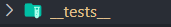

# Food-Ordering-WebApp

# type of testing developers doing

1.Unit testing
2.Integration Testing
3.End to end testing (e2e testing)

unit testing -testing component in isolation.
consider header , only consider to test header component only, and is it render properly

Integration tasting:-testing integration of component
consider search: so many component collaborated to make this feature, test this multiple component talking to each other.we test this develope of action flow

end to end testing: test as soon as user land to the web site to the user leaves. We test all the flows.

# React Testing Library

npm install --save-dev @testing-library/react

. build on top of dom testing library
. provides a set of utilities for writing tests that assert against the DOM output of your components.
. It doesn't rely on any browser APIs or globals like jsdom or Enzyme.

# React Testing Library use # JEST

its known as delightful javascript testing library

npm install --save-dev jest

for babel use additional settings

install this

npm install --save-dev babel-jest @babel/core @babel/preset-env

create a babel.config.js

    module.exports = {
         presets: [['@babel/preset-env', {targets: {node: 'current'}}]],
         };

if using parcel configure it for that

https://parceljs.org/languages/javascript/#babel
parcel by default have own babel configuration
but suppose if we use custom configuration or jest or eslint we can disable babel s configuration and use our configuration
create .parcelrc file and copy configuration to it

form now on babel.config.js will use as configuration and disable default babel transpilation

## Running Tests

To run tests, run the following command

```
  npm run test
```

## Jest configuration

Jest is configured in package.json under "scripts" section with key value pair

```
npx jest --init
```

```
settings

typescript no
environment jsdom
coverage report Yes
provider babel
clear mock calls Yes
```

Test cases should be in "{\* tests\*\*}" folder


file name should be as eg:

Header.test.js/ts

Header.spec.js/ts

```
import { sum } from "../sum"; // importing function to test

test("Check sum of 2 positive nos description of testing", () => {

    // code to test
  expect(sum(2, 5)).toBe(7); // expecting  result to be 7 for input 2,5
});


```

## Testing contact component

inside contact.test.js

```
import { render, screen } from "@testing-library/react";
import Contact from "../Contact";

test("should load contact as component", () => {
  render(<Contact />);
  const heading = screen.getAllByRole("heading");
  expect(heading).toBeInTheDocument();
});

```

## enabling Jsx for test

by adding @babel/preset-react library

```
npm i -d @babel/preset-react
```

include @babel/preset-react inside babel config

now babel.config.js look like

```
module.exports = {
  presets: [
    ["@babel/preset-env", { targets: { node: "current" } }],
    ["@babel/preset-react", { runtime: "automatic" }],
  ],
};

```

then run test

const heading = screen.getAllByRole("heading"); // find it here is heading in the rendered component

> weather the button is there ore note?

```
test("should load contact as component", () => {
  render(<Contact />);
  const heading = screen.getByRole("heading");
  expect(heading).toBeInTheDocument();
  // expect(heading.length).toBeGreaterThan(0);
});

test("should load button inside component", () => {
  render(<Contact />);
  const button = screen.getByRole("button");
  expect(button).toBeInTheDocument();
  // expect(heading.length).toBeGreaterThan(0);
});

```

```

## instead of test you can wite it

it("should should load 2 input boxes", () => {
  render(<Contact />);
  //Querying
  const inputBoxes = screen.getAllByRole("textbox");
  //assertion
  expect(inputBoxes.length).toBe(2);
});

```

different testing examples

```


test("should load contact as component", () => {
  render(<Contact />);
  const heading = screen.getByRole("heading");
  expect(heading).toBeInTheDocument();
  // expect(heading.length).toBeGreaterThan(0);
});

test("should load button inside component", () => {
  //by role
  render(<Contact />);
  const button = screen.getByRole("button");
  expect(button).toBeInTheDocument();
  // expect(heading.length).toBeGreaterThan(0);
});

test("should text matches inside component", () => {
  //by text
  render(<Contact />);
  const button = screen.getByText("Submit");
  expect(button).toBeInTheDocument();
  // expect(heading.length).toBeGreaterThan(0);
});

test("should text matches for place holder", () => {
  render(<Contact />);
  const inputName = screen.getByPlaceholderText("Name");
  expect(inputName).toBeInTheDocument();
  // expect(heading.length).toBeGreaterThan(0);
});

  // role of input box is textbox
test("should should load 2 input boxes", () => {
  render(<Contact />);
  //Querying
  const inputBoxes = screen.getAllByRole("textbox");

  //assertion
  expect(inputBoxes.length).toBe(2);
});

//instead of test you can wite it

it("should should load 2 input boxes", () => {
  render(<Contact />);
  //Querying
  const inputBoxes = screen.getAllByRole("textbox");
  //assertion
  expect(inputBoxes.length).toBe(2);
});

```

## adding to git ignore

/coverage folder can add to git ignore
